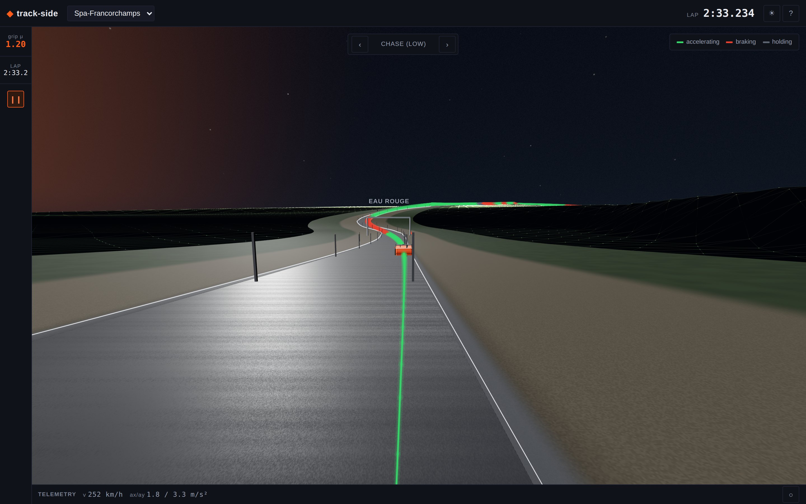

# track-side

An ideal-racing-line optimiser for GT3 cars, on real circuit geometry, with an interactive
3D viewer as the delivery layer. Spa-Francorchamps and Monza.

**Live: <https://jooondam.github.io/track-side/>**


## What it does

The racing line is solved as a **minimum-curvature QP** over lateral offsets in the track's
Frenet frame: the path that a GT3 can carry the most speed through, given the real width of
the road. Speed along it comes from a separate **velocity-profile solver** — a forward/backward
pass over the friction ellipse with aerodynamic downforce, longitudinal load transfer, road
gradient, and tyre load sensitivity.

Splitting those two is the design decision the rest follows from. The min-curvature path does
not depend on the friction coefficient, so grip changes the *speed* around a lap, not the
*line*. That is what makes the grip slider in the viewer cheap enough to be interactive: only
the velocity profile has to be re-solved, and it re-solves on every drag event, in the browser,
in about 10 ms.

Elevation is real, not decorative. z(s) for each circuit is registered from 2023 OpenF1 car-location
data onto the vendored centrelines, and reproduces Eau Rouge's ~40 m climb and each circuit's
documented range.



## How it fits together

```
offline/ (Python)  ->  artifacts/ + public/ (committed JSON, glTF)  ->  src/ (TypeScript viewer)
```

The heavy solving is offline and its output is committed, so the deployed site is static and the
browser never waits on a server:

| stage | what it produces |
| --- | --- |
| `offline/ingest`, `offline/geometry` | cleaned centrelines, widths, curvature, arc length |
| `offline/mincurv` | the minimum-curvature racing line (and a shortest-path baseline to compare against) |
| `offline/velocity` | the reference velocity profile and lap time |
| `offline/elevation`, `offline/mesh` | z(s) from OpenF1 traces, triangulated into glTF track surfaces |
| `offline/mintime` | an offline minimum-time NLP over a μ grid, as a reference solve to check the decomposition against |
| `offline/landmarks` | corner names, braking boards, trackside furniture |

`src/solver/velocity.ts` is a TypeScript port of the Python velocity solver, and it is held to
the original rather than trusted: `src/solver/velocity.test.ts` replays committed fixtures from
the Python implementation on both circuits and asserts lap time to 1e-6 s, v(s) to 5e-6 m/s, and
axle loads to 0.5 N — which is the fixtures' own rounding floor, so anything that fires there is
a port divergence and nothing else.

`src/render/` is the viewer: react-three-fiber, one camera director that owns every camera move,
a heightfield terrain that recedes into a point-and-wire field with no visible boundary, and a
sky dome and fog that share one horizon colour so the terrain's far edge cannot be found.

## Running it

```
npm install
npm run dev            # dev server
npm test               # 75 tests: the solver port, and the render maths
npm run build          # tsc --noEmit && vite build

pip install -e ".[dev]"
pytest                 # the offline pipeline
```

CI builds, tests and deploys to GitHub Pages on every push to `main`
(`.github/workflows/deploy.yml`).

Assets under `/public` are generated by `offline/build_viewer_assets.py` from the committed
artifacts; regenerate after changing the offline pipeline.

## Layout

```
/offline/       Python: ingest, geometry, the solvers, the NLP reference
/artifacts/     generated and committed: track JSON, glTF, mu-family solves, validation plots
/public/        the viewer's own assets, built from /artifacts
/src/           the TypeScript viewer and the ported in-browser solver
/third_party/   vendored upstream data, unmodified, read-only
/docs/          screenshots
```

## Data rights and attribution

```
Track centerlines and widths: TUMFTM/racetrack-database (LGPL-3.0).
Centerlines originally derived from OpenStreetMap, © OpenStreetMap contributors (ODbL 1.0).
Elevation profile derived from OpenF1 (openf1.org), an unofficial project unaffiliated with
the Formula 1 companies. F1, FORMULA 1, and related marks are trade marks of Formula One
Licensing B.V.; this project is not endorsed by or associated with them.
Reference raceline comparison: TUMFTM/global_racetrajectory_optimization (LGPL-3.0),
Heilmeier et al., "Minimum curvature trajectory planning and control for an autonomous race
car", Vehicle System Dynamics 58(10), 2020.
```

See `third_party/README.md` for the vendoring boundary this repo enforces.
