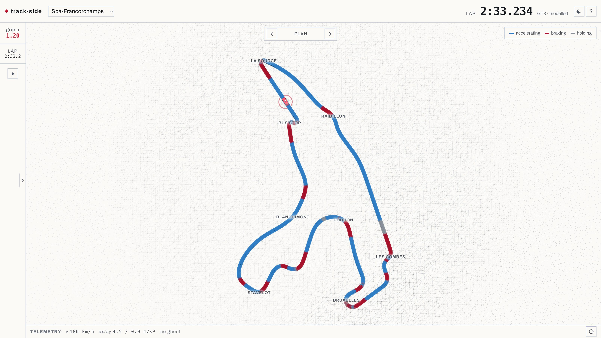
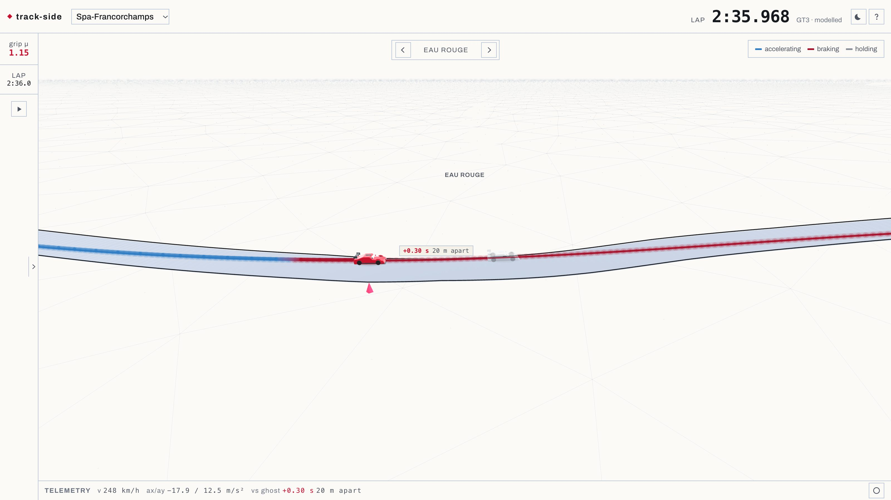
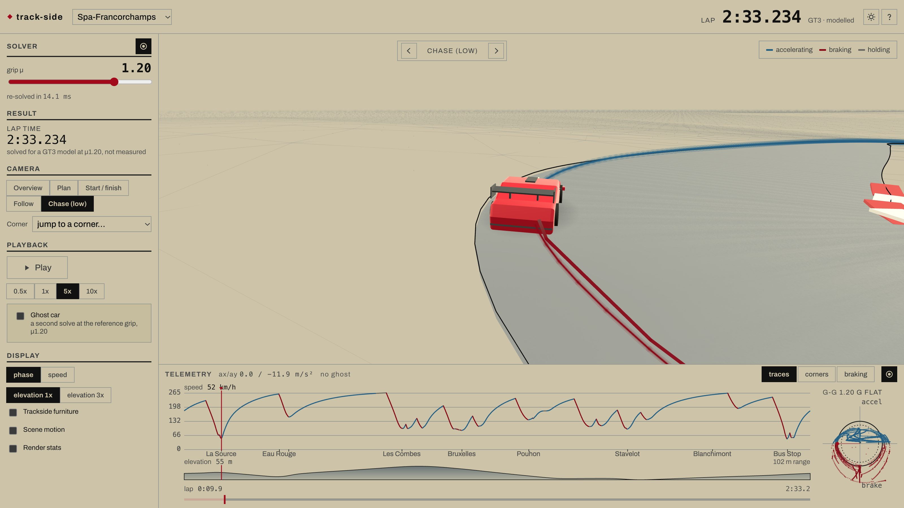

# track-side

An ideal-racing-line optimiser for GT3 cars, on real circuit geometry, with an interactive
3D viewer as the delivery layer. Spa-Francorchamps and Monza.

**Live: <https://jooondam.github.io/track-side/>**



## What it does

The racing line is solved as a **minimum-curvature QP** over lateral offsets in the track's
Frenet frame: the path that a GT3 can carry the most speed through, given the real width of
the road. Speed along it comes from a separate **velocity-profile solver**: a forward/backward
pass over the friction ellipse with aerodynamic downforce, longitudinal load transfer, road
gradient, and tyre load sensitivity.

Splitting those two is the design decision the rest follows from. The min-curvature path does
not depend on the friction coefficient, so grip changes the *speed* around a lap, not the
*line*. That is what makes the grip slider in the viewer cheap enough to be interactive: only
the velocity profile has to be re-solved, and it re-solves on every drag event, in the browser,
in about 10 ms.

Elevation is real, not decorative. z(s) for each circuit is registered from 2023 OpenF1 car-location
data onto the vendored centrelines, and reproduces Eau Rouge's ~40 m climb and each circuit's
documented range.



That gap **is** the grip difference. Both cars run off one lap clock, so the 20 m between them
at Eau Rouge is what 0.05 of friction costs by the time you get there, drawn rather than quoted.

## How it fits together

```
offline/ (Python)  ->  artifacts/ + public/ (committed JSON, glTF)  ->  src/ (TypeScript viewer)
```

The heavy solving is offline and its output is committed, so the deployed site is static and the
browser never waits on a server:

| stage | what it produces |
| --- | --- |
| `offline/ingest`, `offline/geometry` | cleaned centrelines, widths, curvature, arc length |
| `offline/mincurv` | the minimum-curvature racing line (and a shortest-path baseline to compare against) |
| `offline/velocity` | the reference velocity profile and lap time |
| `offline/elevation`, `offline/mesh` | z(s) from OpenF1 traces, triangulated into glTF track surfaces |
| `offline/mintime` | an offline minimum-time NLP over a μ grid, as a reference solve to check the decomposition against |
| `offline/landmarks` | corner names measured against the line, braking boards, trackside furniture |

`src/solver/velocity.ts` is a TypeScript port of the Python velocity solver, and it is held to
the original rather than trusted: `src/solver/velocity.test.ts` replays committed fixtures from
the Python implementation on both circuits and asserts lap time to 1e-6 s, v(s) to 5e-6 m/s, and
axle loads to 0.5 N, which is the fixtures' own rounding floor, so anything that fires there is
a port divergence and nothing else.

`src/render/` is the viewer: react-three-fiber, one camera director that owns every camera move,
a heightfield terrain that recedes into a point-and-wire field with no visible boundary, and a
sky dome and fog that share one horizon colour so the terrain's far edge cannot be found.



`src/ui/` is the instrument panel, drawn as an engineer's run sheet rather than as a dashboard:
speed, delta and elevation traces against arc length, a g-g square, a per-corner table, and the
**braking report**, which is the one output here that transfers to actually driving the circuit.
It gives each corner's braking point against the distance boards on the way in, the axle that
reaches its friction circle first, and how far that point moves when the grip changes. That last
column is the strongest number in the project: the boards are placed rather than surveyed, but
both solves read the same boards, so the difference between two grip levels is exact whatever
the boards' own error. At mu 1.40 the car brakes 30 m later into Monza's first chicane than at
mu 1.20.

Corner positions are measured from the line that ships, not read off a circuit map, and
`offline/landmarks/checks.py` holds them within 25 m of a curvature maximum in that line. They
were not always: see `PLAN.md`.

## Does it work

`docs/VALIDATION.md` is the long answer: every table in it is printed by
`python -m offline.validation.report`, computed from the vendored inputs at the moment it runs
rather than read back from a recorded result. The short answer:

- The **decomposition** (solve the path once, then the speed along it) costs 3.6% to 8.7% of lap
  time against a full minimum-time NLP over the same geometry and the same physics, and the gap
  widens as grip falls.
- The **TypeScript port** matches the Python solver to 1e-6 s of lap time, 5e-6 m/s of v(s) and
  0.5 N of axle load, which is the fixtures' own rounding floor rather than a chosen bound.
- The **elevation registration** recovers OpenF1's undocumented unit scale as 0.099962 at Spa and
  0.099960 at Monza, against a true 0.1, from two datasets sharing no code path but the algorithm.
- Spa's elevation range comes out at 102.1 m against a documented ~100 m, and the Eau Rouge climb
  at 40.8 m over the 650 m from the bottom of the compression.

And the part that matters more than any of it: **trust the deltas, not the absolutes.** The lap
time is a model of a car nobody measured. How much later you brake at μ1.40 than at μ1.20 is
exact, because both solves read the same boards. Section 10 of that document is the argument.

## Running it

```
npm install
npm run dev            # dev server
npm test               # 259 tests: the solver port, the render maths, the reports
npm run build          # tsc --noEmit && vite build

pip install -e ".[dev,reference]"
pytest                 # 228 tests: the offline pipeline and its gates
python -m offline.validation.report    # the tables in docs/VALIDATION.md
```

The `reference` extra is CasADi, for the minimum-time NLP. Without it those 10 tests skip and the
NLP column of the validation report is read from the committed sweep instead of re-solved.

CI builds, tests and deploys to GitHub Pages on every push to `main`
(`.github/workflows/deploy.yml`).

Assets under `/public` are generated by `offline/build_viewer_assets.py` from the committed
artifacts; regenerate after changing the offline pipeline.

The three screenshots above are generated too: `npm run shots` rewrites them from the running
viewer, at the same URLs anyone can open. If a change to the viewer makes them wrong, the
next run leaves that in `git status` rather than in the README.

## Layout

```
/offline/       Python: ingest, geometry, the solvers, the NLP reference
/artifacts/     generated and committed: track JSON, glTF, mu-family solves, validation plots
/public/        the viewer's own assets, built from /artifacts
/src/           the TypeScript viewer and the ported in-browser solver
/third_party/   vendored upstream data, unmodified, read-only
/docs/          the validation writeup, and the three screenshots above
```

## Data rights and attribution

```
Track centerlines and widths: TUMFTM/racetrack-database (LGPL-3.0).
Centerlines originally derived from OpenStreetMap, © OpenStreetMap contributors (ODbL 1.0).
Elevation profile derived from OpenF1 (openf1.org), an unofficial project unaffiliated with
the Formula 1 companies. F1, FORMULA 1, and related marks are trade marks of Formula One
Licensing B.V.; this project is not endorsed by or associated with them.
Reference raceline comparison: TUMFTM/global_racetrajectory_optimization (LGPL-3.0),
Heilmeier et al., "Minimum curvature trajectory planning and control for an autonomous race
car", Vehicle System Dynamics 58(10), 2020.
```

See `third_party/README.md` for the vendoring boundary this repo enforces.
